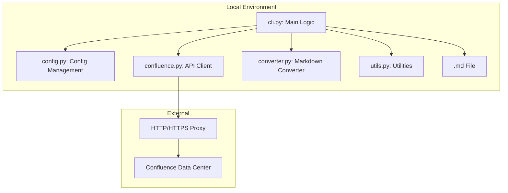
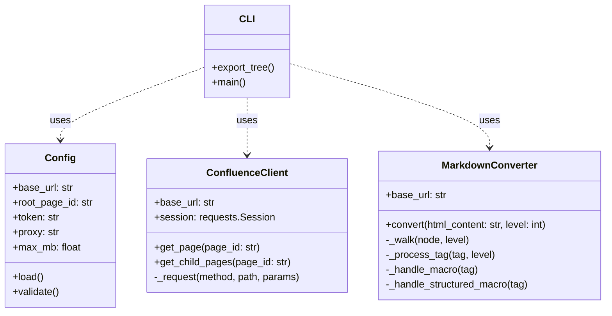
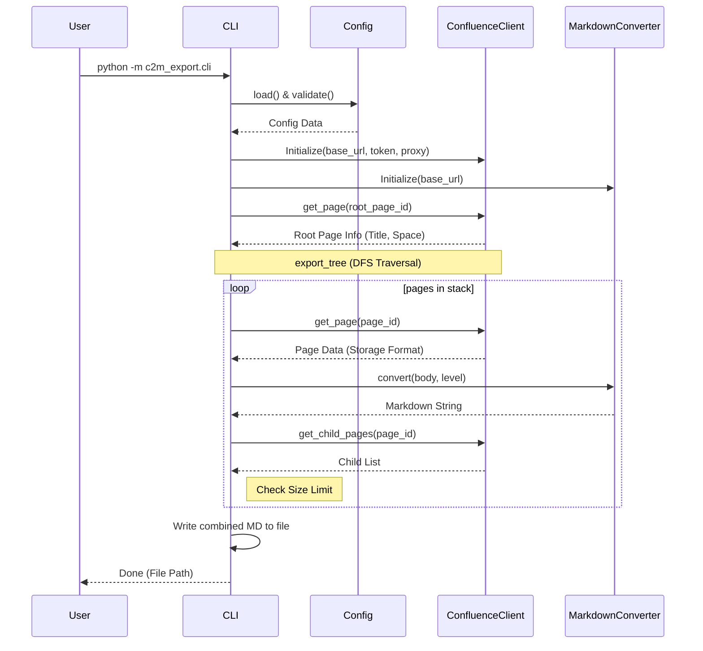
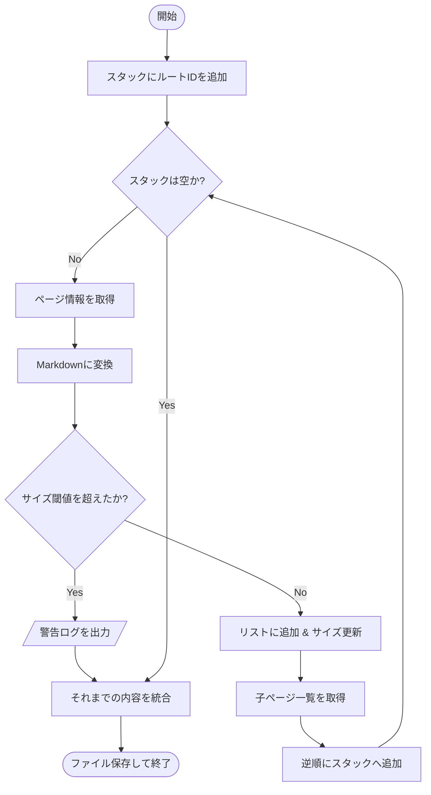

# 開発者向けドキュメント (README_DEV.md)

このドキュメントは、C2M-Export の内部構造、設計思想、および拡張方法について解説します。

## システム概要

C2M-Export は、Confluence Data Center のページツリーを再帰的に取得し、1つの Markdown ファイルに統合する Python ベースの CLI ツールです。特に AI（LLM）のナレッジベース作成に最適化されており、メタデータの付与や階層構造に応じた見出しの調整を行います。

## システム構成図

システムの主要コンポーネントと外部接続の構成を以下に示します。



## クラス図

主要なクラスとその責務、および関係性を以下に示します。



## 処理シーケンス

全体の実行フローは以下の通りです。



## 探索アルゴリズムのフローチャート

`export_tree` 関数における深さ優先探索（DFS）とサイズ制限の処理フローです。



## 拡張ポイント

### 新しいマクロの変換サポート
`c2m_export/converter.py` の `MarkdownConverter` クラスにハンドラを追加します。

1.  `_handle_structured_macro` または `_handle_macro` 内にマクロ名の判定を追加。
2.  BeautifulSoup を使用してマクロのパラメータやボディを抽出。
3.  Markdown 形式の文字列を返す。

### API呼び出しの追加
`c2m_export/confluence.py` の `ConfluenceClient` にメソッドを追加します。共通の `_request` メソッドを使用することで、リトライロジックやProxy設定が自動的に適用されます。

## テスト方法

`pytest` を使用してテストを実行します。

```bash
# プロジェクトルートで実行
PYTHONPATH=. pytest
```

### 主要なテストファイル
- `tests/test_converter.py`: HTMLからMarkdownへの変換ロジックを検証。
- `tests/test_utils.py`: ファイル名サニタイズやサイズ計算のロジックを検証。
