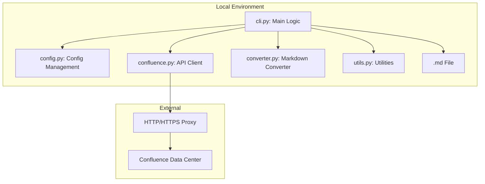
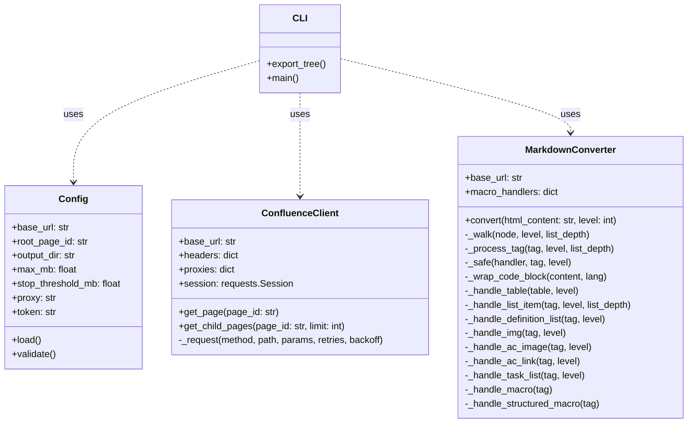
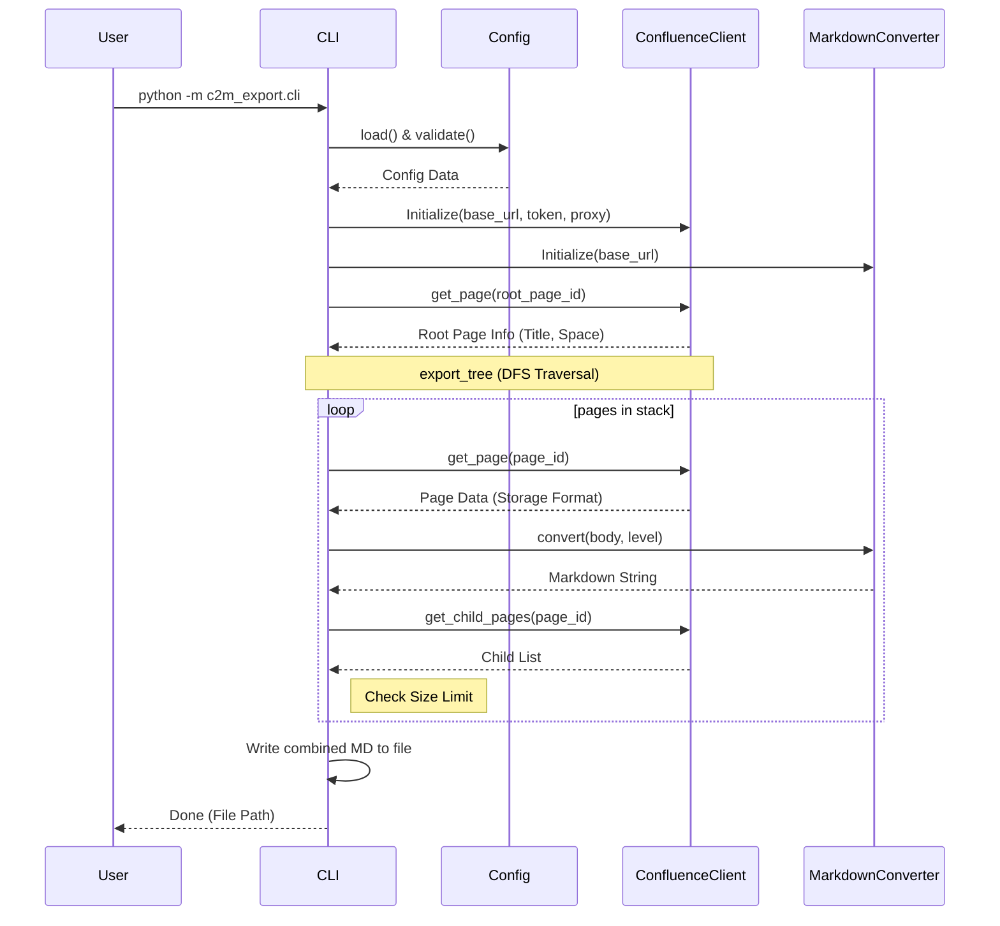
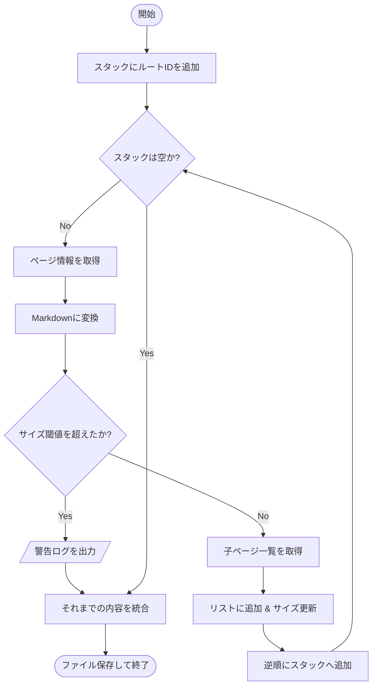

# 開発者向けドキュメント (README_DEV.md)

このドキュメントは、C2M-Export の内部構造、設計思想、および拡張方法について解説します。

## システム概要

C2M-Export は、Confluence Data Center のページツリーを再帰的に取得し、1つの Markdown ファイルに統合する Python ベースの CLI ツールです。特に AI（LLM）のナレッジベース作成に最適化されており、メタデータの付与や階層構造に応じた見出しの調整を行います。

## システム構成図

システムの主要コンポーネントと外部接続の構成を以下に示します。


```mermaid
graph TD
    subgraph "Local Environment"
        CLI[cli.py: Main Logic]
        Config[config.py: Config Management]
        Client[confluence.py: API Client]
        Converter[converter.py: Markdown Converter]
        Utils[utils.py: Utilities]
        Output[.md File]
    end

    subgraph "External"
        Confluence[Confluence Data Center]
        Proxy[HTTP/HTTPS Proxy]
    end

    CLI --> Config
    CLI --> Client
    CLI --> Converter
    CLI --> Utils
    Client --> Proxy
    Proxy --> Confluence
    CLI --> Output
```

## クラス図

主要なクラスとその責務、および関係性を以下に示します。


```mermaid
classDiagram
    class Config {
        +base_url: str
        +root_page_id: str
        +output_dir: str
        +max_mb: float
        +stop_threshold_mb: float
        +proxy: str
        +token: str
        +load()
        +validate()
    }

    class ConfluenceClient {
        +base_url: str
        +headers: dict
        +proxies: dict
        +session: requests.Session
        +get_page(page_id: str)
        +get_child_pages(page_id: str, limit: int)
        -_request(method, path, params, retries, backoff)
    }

    class MarkdownConverter {
        +base_url: str
        +macro_handlers: dict
        +convert(html_content: str, level: int)
        -_walk(node, level, list_depth)
        -_process_tag(tag, level, list_depth)
        -_safe(handler, tag, level)
        -_wrap_code_block(content, lang)
        -_handle_table(table, level)
        -_handle_list_item(tag, level, list_depth)
        -_handle_definition_list(tag, level)
        -_handle_img(tag, level)
        -_handle_ac_image(tag, level)
        -_handle_ac_link(tag, level)
        -_handle_task_list(tag, level)
        -_handle_macro(tag)
        -_handle_structured_macro(tag)
    }

    class CLI {
        +export_tree()
        +main()
    }

    CLI ..> Config : uses
    CLI ..> ConfluenceClient : uses
    CLI ..> MarkdownConverter : uses
```

## 処理シーケンス

全体の実行フローは以下の通りです。


```mermaid
sequenceDiagram
    participant User
    participant CLI
    participant Config
    participant Client as ConfluenceClient
    participant Conv as MarkdownConverter

    User->>CLI: python -m c2m_export.cli
    CLI->>Config: load() & validate()
    Config-->>CLI: Config Data
    CLI->>Client: Initialize(base_url, token, proxy)
    CLI->>Conv: Initialize(base_url)

    CLI->>Client: get_page(root_page_id)
    Client-->>CLI: Root Page Info (Title, Space)

    Note over CLI, Client: export_tree (DFS Traversal)
    loop pages in stack
        CLI->>Client: get_page(page_id)
        Client-->>CLI: Page Data (Storage Format)
        CLI->>Conv: convert(body, level)
        Conv-->>CLI: Markdown String
        CLI->>Client: get_child_pages(page_id)
        Client-->>CLI: Child List
        Note right of CLI: Check Size Limit
    end

    CLI->>CLI: Write combined MD to file
    CLI-->>User: Done (File Path)
```

## 探索アルゴリズムのフローチャート

`export_tree` 関数における深さ優先探索（DFS）とサイズ制限の処理フローです。


```mermaid
flowchart TD
    Start([開始]) --> Init[スタックにルートIDを追加]
    Init --> Pop{スタックは空か?}
    Pop -- No --> Fetch[ページ情報を取得]
    Fetch --> Convert[Markdownに変換]
    Convert --> CheckSize{サイズ閾値を超えたか?}

    CheckSize -- Yes --> Warning[/警告ログを出力/]
    Warning --> Combine[それまでの内容を統合]

    CheckSize -- No --> GetChildren[子ページ一覧を取得]
    GetChildren --> AddMD[リストに追加 & サイズ更新]
    AddMD --> Push[逆順にスタックへ追加]
    Push --> Pop

    Pop -- Yes --> Combine
    Combine --> Save([ファイル保存して終了])
```

## 変換ロジックの設計（converter.py）

`MarkdownConverter` は `convert` → `_walk` → `_process_tag` の再帰巡回で構成されます。
AI ナレッジ利用を最優先し、**情報を欠損させない**ことを設計原則とします。

### タグ変換の追加ポイント（`_process_tag`）

タグごとの分岐は `_process_tag` に集約されています。処理は「特異なもの → 汎用」の順です。
主な対応要素:

- インライン/ブロック: `blockquote`（`>`）、`hr`（`---`）、`del/s/strike`（`~~`）、
  `u/sup/sub`（テキストのみ）、`pre`（コードブロック）、`dl/dt/dd`（定義リスト）。
- リスト: `ul/ol/li`。祖先リストのマーカー幅（`ol` は3列、`ul` は2列）を加算し、
  子項目のインデントを親項目の本文開始位置に揃えます。`_handle_list_item` が項目本文と子リストを分離して出力します。
- 表: `_handle_table` と補助の `_collect_table_rows` / `_table_row_cells`。
  `thead/tbody/tfoot` を考慮して行を収集し（`recursive=False` でネスト表の tr を親に取り込まない）、
  ヘッダー不明時は空ヘッダー行で区切り線を成立させます。セル内の `|` はエスケープ、改行は `<br>`。
- Confluence 固有: `ac:image`、`ac:link`（ページ/ユーザー/添付）、`ac:emoticon`、
  `ac:task-list`、`ac:layout*`。

画像と添付リンクの参照先は `_format_destination` で整形し、空白や丸括弧を含む場合のみ山括弧で囲みます。

### コードフェンスの動的伸長（`_wrap_code_block`）

コードブロックを生成する箇所（legacy code/noformat、structured-macro の plain-text-body、
plantuml、`pre` 単体）はすべて `_wrap_code_block(content, lang)` を経由します。
中身に含まれる最長の連続バッククォートより 1 つ長いフェンス（最小 3 連）を用いることで、
コード中の ```` ``` ```` によってフェンスが割れ、後続テキスト（同一ページの後続要素や
次ページの本文）をコードとして巻き込む構文汚染を防ぎます（CommonMark 準拠）。

### 堅牢性（例外の非伝播）

個別ハンドラ（表・画像・リンク・タスク・マクロ）は `_safe` ラッパー経由で呼び出され、
想定外の構造で例外が発生しても変換全体を止めず、空文字を返しつつ日本語の警告ログを出します。
これにより、不完全なページデータが後続ページの変換に波及しません。

### ページリンクの方針（A案）

`ac:link` + `ri:page` は、`ri:space-key` が判明する場合のみ `[タイトル](絶対URL)` を出力し、
不明な場合はタイトルをテキストとして残します。ファイル内アンカー解決や相対パス解決は行いません。

## CLI の部分成功設計（cli.py）

`export_tree` は個別ページの失敗を `try/except ... continue` で捕捉し、スキップした page_id を
`skipped_page_ids` に集計します。戻り値は `(md, total_bytes, page_count, skipped_page_ids)` です。
子ページ一覧を取得してから本文・バイト数・成功数を確定し、取得失敗したページを二重集計しません。
Web 側も4つの戻り値を受け取ります。
処理完了時に成功数・スキップ数・スキップ page_id をサマリログとして出力します。

## 拡張ポイント

### 新しいマクロの変換サポート
`c2m_export/converter.py` の `MarkdownConverter` クラスにハンドラを追加します。

1.  `_handle_structured_macro` または `_handle_macro` 内にマクロ名の判定を追加。
2.  BeautifulSoup を使用してマクロのパラメータやボディを抽出。
3.  Markdown 形式の文字列を返す。コードブロックを出力する場合は `_wrap_code_block` を使う。

### API呼び出しの追加
`c2m_export/confluence.py` の `ConfluenceClient` にメソッドを追加します。共通の `_request` メソッドを使用することで、リトライロジックやProxy設定が自動的に適用されます。

## テスト方法

`pytest` を使用してテストを実行します。

```bash
# プロジェクトルートで実行
PYTHONPATH=. pytest
```

### 主要なテストファイル
- `tests/test_converter.py`: 基本的な HTML から Markdown への変換ロジックを検証。
- `tests/test_converter_extended.py`: 表（thead/tbody）、インライン/ブロック要素、ネストリスト、
  タスクリスト、画像、ページリンク・メンション・絵文字・レイアウトなど拡充表現を検証。
- `tests/test_macros_extended.py`: 各種マクロの変換を検証。
- `tests/test_robustness.py`: コードフェンスの動的伸長、変換器の例外非伝播、
  CLI の波及防止・部分成功・ログ、ページ連結でのフェンス波及防止を検証。
- `tests/test_cli_overwrite.py`: CLI の上書き挙動・フェイルファストを検証。
- `tests/test_utils.py`: ファイル名サニタイズやサイズ計算のロジックを検証。
