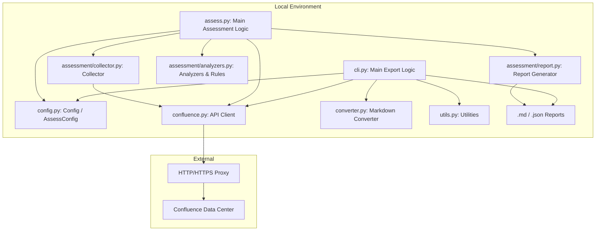
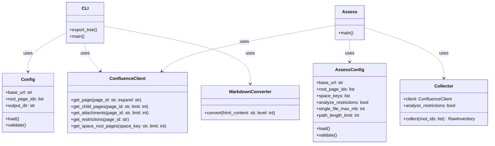
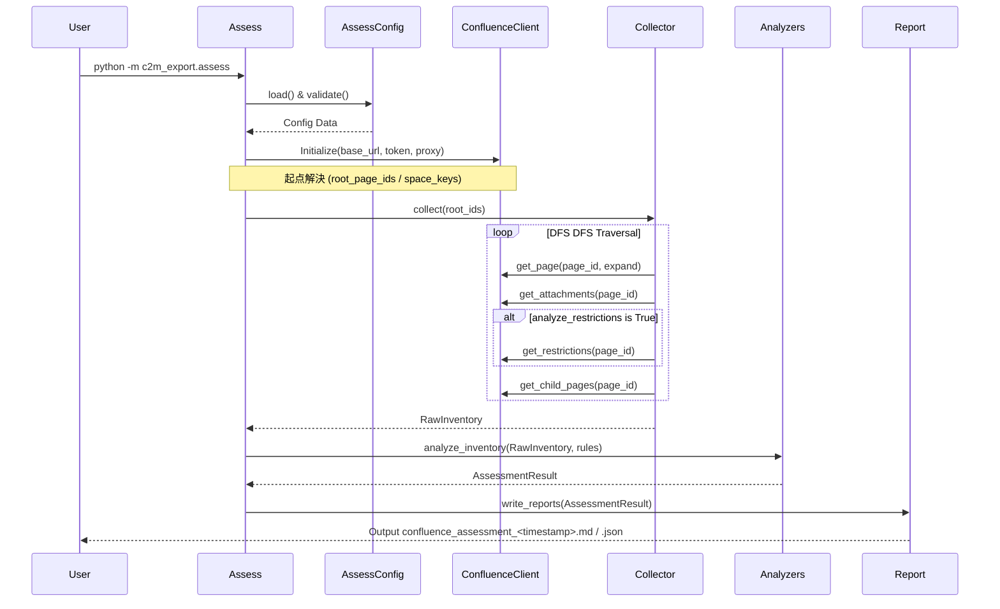
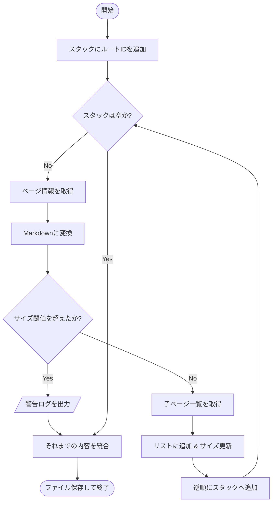

# 開発者向けドキュメント (README_DEV.md)

このドキュメントは、C2M-Export の内部構造、設計思想、および拡張方法について解説します。

## システム概要

C2M-Export は、Confluence Data Center のページツリーを再帰的に取得し、1つの Markdown ファイルに統合する Python ベースの CLI ツールです。また、実エクスポート前に Confluence ワークスペース全体の規模・構造・移設リスク（SharePoint/OneDrive 向け制約など）を把握するための**アセスメント（分析）機能**も提供しています。

## システム構成図

システムの主要コンポーネントと外部接続の構成を以下に示します。


```mermaid
graph TD
    subgraph "Local Environment"
        CLI[cli.py: Main Export Logic]
        Assess[assess.py: Main Assessment Logic]
        Config[config.py: Config / AssessConfig]
        Client[confluence.py: API Client]
        Converter[converter.py: Markdown Converter]
        Collector[assessment/collector.py: Collector]
        Analyzers[assessment/analyzers.py: Analyzers & Rules]
        Report[assessment/report.py: Report Generator]
        Utils[utils.py: Utilities]
        Output[.md / .json Reports]
    end

    subgraph "External"
        Confluence[Confluence Data Center]
        Proxy[HTTP/HTTPS Proxy]
    end

    CLI --> Config
    CLI --> Client
    CLI --> Converter
    CLI --> Utils

    Assess --> Config
    Assess --> Client
    Assess --> Collector
    Collector --> Client
    Assess --> Analyzers
    Assess --> Report

    Client --> Proxy
    Proxy --> Confluence
    CLI --> Output
    Report --> Output
```

## アセスメント機能のモジュール構造とアーキテクチャ設計

アセスメント機能（`c2m_export/assessment/`）は、I/O 層（Collector）と純粋集計・分析ロジック層（Analyzers & Rules）を完全に分離するアーキテクチャを採用しています。

```
c2m_export/
├── confluence.py      # [拡張] get_attachments, download_attachment, get_restrictions, get_space_root_pages 等を追加
├── config.py          # [拡張] AssessConfig, FsExportConfig, PermissionExportConfig, AnalysisConfig を追加
├── analyze.py         # [新規 0007] 分析 CLI エントリーポイント（python -m c2m_export.analyze）
├── mcp_server.py      # [新規 0007] MCP サーバエントリーポイント（FastMCP, stdio トランスポート）
├── analysis/          # [新規 0007] 分析純粋ロジック・共通 API 層一式
│   ├── __init__.py
│   ├── api.py         # 共通 1 層 (run_analysis) と独自例外・エラーコード分類
│   ├── params.py      # AnalysisParams dataclass と境界検証
│   ├── response.py    # AnalysisResponse / ErrorObject とスキーマモデル
│   ├── sanitize.py    # トークン実値・Authorization/Bearer ヘッダの多層防御マスク
│   ├── extractors.py  # ユースケース別個別一覧抽出（API 非依存）
│   ├── categories.py # 圧縮形式カテゴリ集約純粋ロジック
│   ├── macros.py      # マクロ解析・集計・修復区分判定（converter 方針写像）
│   ├── provenance.py  # provenance 付与（enrich_stale / enrich_restricted / enrich_empty_with_attachments など）
│   └─ workspace.py   # workspace / visibility / environment 集計
├── assess.py          # 分析モードのエントリーポイント（python -m c2m_export.assess）
├── fsexport.py        # ファイルシステムモードのエントリーポイント（python -m c2m_export.fsexport / sync・resume分岐）
├── permexport.py      # [新規 0006] 権限エクスポートのエントリーポイント（python -m c2m_export.permexport）
├── permission/        # [新規 0006] 権限エクスポートロジック一式
│   ├── __init__.py
│   ├── models.py      # PagePermission / PermissionReport / PermissionResult
│   ├── collector.py   # DFS 巡回で各ページの制限情報を収集 (I/O)・部分成功処理
│   ├── report.py      # Markdown (集約/分散) / JSON レポート生成純粋ロジック
│   └── summary.py     # 実行サマリ生成（ログ + 日時サフィックス付きファイル出力）
├── fs_export/         # ファイルシステム出力ロジック一式
│   ├── __init__.py
│   ├── manifest.py    # [新規 0005] マニフェストモデル・原子的保存/読み込み・破損検出・スコープ検証
│   ├── diff.py        # [新規 0005] 前回マニフェスト × 現在インベントリの差分判定純粋ロジック (DiffPlan)
│   ├── sync.py        # [新規 0005] 軽量インベントリ収集・同期実行・レジューム処理・マニフェスト更新
│   ├── quarantine.py  # [新規 0005] 削除・置換時の退避ディレクトリ操作 (_c2m_quarantine)
│   ├── models.py      # PageNode / AttachmentRef / SkipRecord / ExportResult 等
│   ├── tree.py        # DFS 巡回とローカルパス割当（命名・衝突回避・パス長警告）
│   ├── writer.py      # 本文 + Frontmatter 書き込み、添付 DL 保存、単一ファイル上限判定
│   ├── frontmatter.py # YAML フロントマターの生成（純粋関数）
│   ├── links.py       # 本文中の添付参照リンク書き換え（純粋関数）
│   └── summary.py     # 実行結果サマリ生成（ログ + 日時サフィックス付きファイル出力）
└── assessment/        # 分析ロジック一式
    ├── __init__.py
    ├── models.py      # PageMeta / AttachmentMeta / RestrictionMeta / RawInventory / AssessmentResult 等
    ├── collector.py   # DFS巡回でページ/添付/権限/更新情報のメタデータを収集する I/O 層
    ├── rules.py       # SharePoint/OneDrive 判定ルール（パス長、禁止文字、予約語、ブロック拡張子等）
    ├── analyzers.py   # RawInventory を入力とする純粋関数群（API非依存＝テスト容易）
    └── report.py      # AssessmentResult から Markdown / JSON を生成
```

### ファイルシステムエクスポートのリンクと探索失敗

`fs_export/links.py` は山括弧付きの添付参照を認識し、書き換え先に空白や丸括弧が含まれる場合はリンク先を山括弧で囲みます。
`#` で始まる参照は添付マップとの照合を優先し、一致しない場合のみアンカーとして保持します。一致した添付は通常どおり書き換え、`relative` モードで未保存の場合は未解決件数に含めます。
`build_page_tree` は任意の `skipped_pages` リストにルートページ・子ページ・Space のルート一覧の取得失敗を追記します（既存の戻り値は維持）。
`fsexport.py` は探索失敗を `ExportResult.skipped_pages` に合流してからサマリを出力します。全起点の取得失敗時も、失敗サマリを出力して終了コード 1 で終了します。

サマリ出力は、出力先ディレクトリの作成とファイル書き込みを同じ例外処理で保護し、失敗時もサマリのログ出力と戻り値を維持します。

### 同期時の探索・パス・マニフェスト

`Inventory.discovery_incomplete` は Space のルート一覧、ページ詳細、子ページ一覧、添付一覧の取得失敗時に設定し、`compute_diff` はページ・添付の DELETE を保留します。保留した添付のマニフェスト情報も保持します。
`compute_paths_for_inventory` は仮想ルートを含む親の処理時に兄弟のディレクトリ名を確定し、全階層で衝突を回避します。
MOVE_RENAME は `computed_paths` で再計算した新しい親と、移動先を現在占有するページの移動完了を待って実行します。保留が解消しない循環では出力先直下の `.c2m_move_*` へ一時退避し、通常移動・退避とも子孫の記録を実配置へ更新して保存します。退避後の中断もマニフェストの保存先から再開できます。
移動対象以外の既存出力は、移動元が存在しなくても入れ子や上書きを行わずエラー停止します（設計書の一般的な競合時退避から変更）。例外は `--resume` 指定時の同一ページの移動済み出力のみです。改名前・改名後の既存本文すべてのフロントマターを検査し、`confluence_url` が同じサーバ・ページを指し、任意の `confluence_page_id` も一致することを確認します。識別不能な出力は停止します。UNCHANGED も再計算した保存先で本文を確認し、欠落時はそのパスへ再取得します。
添付の DELETE と改名前の旧保存名は、ページ移動後の相対パスと `attachment_dir_name` を用いて `deletion_policy` に従い処理します。
フル出力の writer は任意の `manifest_pages` 辞書へ本文出力に成功したページの取得済みメタデータ・実際の保存先・添付状態を追記し、`fsexport.py` はそれを含むマニフェストを保存します。

### 共通分析 API の設定・失敗処理・マスキング

`analysis/api.py` は、設定オブジェクトに存在する `single_file_max_mb`・`path_length_limit`・`blocked_extensions`・`attachment_dir_name` だけを `analyze_inventory` に渡します。未定義の属性は集計関数の既定値に委ね、明示された空の拡張子集合も保持します。
`count_macros` の解析・集計例外は Collector が捕捉し、警告ログと `macro_parse_failed_count` に反映します。失敗ページの部分集計は採用せず、ほかのページの収集を継続します。
`sanitize_text` は引用符・バックスラッシュ・区切りでトークンを止め、Basic の方式名と認証情報をまとめてマスクします。また、URL クエリパラメータに含まれる機密キー (`token`, `access_token`, `api_key`, `secret`, `password` 等) の値も非表示化 (`***REDACTED***`) し、ハッシュフラグメント (`#`) を維持します。このサニタイズ処理は CLI 出力だけでなく MCP サーバの応答オブジェクト (`response.to_dict()`) にも一貫して適用されます。

`ConfluenceClient._request` と `download_attachment` は、最終試行の通信例外を URL・元メッセージを含まない `RequestException` に変換し、元例外のトレースバック表示を抑制します。HTTP エラーは `HTTPError` と `response.status_code` を保持するため、401/403・404 の分析エラー分類は維持します。応答オブジェクトにはステータスコードだけを引き継ぎ、URL・ヘッダ・本文・元リクエストを含めません。
401・403・404 の `HTTPError` は初回で同じサニタイズ処理を適用して送出し、再試行・待機は行いません。429・5xx・通信エラーの指数バックオフによる再試行は維持します。
5xx の指数バックオフは次の試行がある場合だけ行い、最終試行では `raise_for_status()` を経由して同じサニタイズ処理を適用します。分析 API では `root_page_ids`・`space_keys` の両経路で `API_ERROR` として扱います。

### Agent Skill (`SKILL.md`) の管理・同期運用方針

C2M-Export の分析 Skill 定義 (`SKILL.md`) は、GitHub Copilot、Kiro、および汎用 Agent Skills の 3 形態で同一の標準フォーマットを採用しています。各ツールの自動検出・発火条件（`.kiro/skills/`: Kiro、`.github/skills/`: GitHub Copilot、`skills/`: 汎用 Agent Skills）に合わせて 3 箇所に配置しています。

- **正本位置**: `skills/confluence-analysis/SKILL.md` (および `skills/confluence-analysis/scripts/`)
- **複製配置先**:
  - GitHub Copilot プロジェクトスキル: `.github/skills/confluence-analysis/SKILL.md`
  - Kiro スキル: `.kiro/skills/confluence-analysis/SKILL.md`

**運用原則**:
SKILL.md やスクリプトに対する修正・機能拡張を行う際は、**必ず正本 `skills/confluence-analysis/` 配下のファイルを直接編集**し、編集完了後に複製配置先（`.github/skills/` および `.kiro/skills/`）へ同一ファイルを同期（上書きコピー）してください。正本と複製先の不一致を防ぐため、直接複製先ファイルを編集することは禁止されています。

### MCP サーバのアーキテクチャ

FastMCP（`mcp` SDK）を用いて分析ツール `analyze_confluence` を公開します。
- `mcp` SDK は optional 依存であり、`requirements-mcp.txt` に分離されています。
- `c2m_export/mcp_server.py` 内で `mcp` を遅延 import することにより、SDK 未導入環境でもメイン CLI やライブラリとしての利用に影響を及ぼしません。

### 本文サイズ概算の偏りについての設計背景

アセスメント機能では、大量ページの巡回および API 負荷の抑制・処理時間短縮を目的として、**添付バイナリのダウンロードや Markdown 変換処理を行いません**。

- **添付ファイルサイズ**: Confluence API メタデータ (`extensions.fileSize`) をそのまま合算するため、実測値とほぼ一致します。
- **ページ本文サイズ**: Storage Format (XHTML) の UTF-8 バイト長を素に概算します。Markdown 変換後は一般に HTML/XHTML タグの削除によってサイズが減少するため、本文の推定総サイズは**やや過大（安全側）に試算**されます。

> 偏りの結論: 本文はやや過大、添付はほぼ正確となり、総容量は「上振れ方向に安全側」の見積もりとなります。この前提は生成される Markdown レポートの注記およびドキュメントに明記されます。

## クラス図

主要なクラスとその責務、および関係性を以下に示します。


```mermaid
classDiagram
    class Config {
        +base_url: str
        +root_page_ids: list
        +output_dir: str
        +load()
        +validate()
    }

    class AssessConfig {
        +base_url: str
        +root_page_ids: list
        +space_keys: list
        +analyze_restrictions: bool
        +single_file_max_mb: int
        +path_length_limit: int
        +load()
        +validate()
    }

    class ConfluenceClient {
        +get_page(page_id: str, expand: str)
        +get_child_pages(page_id: str, limit: int)
        +get_attachments(page_id: str, limit: int)
        +get_restrictions(page_id: str)
        +get_space_root_pages(space_key: str, limit: int)
    }

    class Collector {
        +client: ConfluenceClient
        +analyze_restrictions: bool
        +collect(root_ids: list) RawInventory
    }

    class MarkdownConverter {
        +convert(html_content: str, level: int)
    }

    class CLI {
        +export_tree()
        +main()
    }

    class Assess {
        +main()
    }

    CLI ..> Config : uses
    CLI ..> ConfluenceClient : uses
    CLI ..> MarkdownConverter : uses

    Assess ..> AssessConfig : uses
    Assess ..> ConfluenceClient : uses
    Assess ..> Collector : uses
```

## 処理シーケンス

アセスメントモードの実行フローは以下の通りです。


```mermaid
sequenceDiagram
    participant User
    participant Assess
    participant AssessConfig
    participant Client as ConfluenceClient
    participant Collector
    participant Analyzers
    participant Report

    User->>Assess: python -m c2m_export.assess
    Assess->>AssessConfig: load() & validate()
    AssessConfig-->>Assess: Config Data
    Assess->>Client: Initialize(base_url, token, proxy)

    Note over Assess, Client: 起点解決 (root_page_ids / space_keys)
    Assess->>Collector: collect(root_ids)

    loop DFS DFS Traversal
        Collector->>Client: get_page(page_id, expand)
        Collector->>Client: get_attachments(page_id)
        alt analyze_restrictions is True
            Collector->>Client: get_restrictions(page_id)
        end
        Collector->>Client: get_child_pages(page_id)
    end
    Collector-->>Assess: RawInventory

    Assess->>Analyzers: analyze_inventory(RawInventory, rules)
    Analyzers-->>Assess: AssessmentResult

    Assess->>Report: write_reports(AssessmentResult)
    Report-->>User: Output confluence_assessment_<timestamp>.md / .json
```

## 探索アルゴリズムのフローチャート

`export_tree` 関数における深さ優先探索（DFS）とサイズ制限の処理フローです。


```mermaid
flowchart TD
    Start([開始]) --> Init[スタックにルートIDを追加]
    Init --> Pop{スタックは空か?}
    Pop -- No --> Fetch[ページ情報を取得]
    Fetch --> Convert[Markdownに変換]
    Convert --> CheckSize{サイズ閾値を超えたか?}

    CheckSize -- Yes --> Warning[/警告ログを出力/]
    Warning --> Combine[それまでの内容を統合]

    CheckSize -- No --> GetChildren[子ページ一覧を取得]
    GetChildren --> AddMD[リストに追加 & サイズ更新]
    AddMD --> Push[逆順にスタックへ追加]
    Push --> Pop

    Pop -- Yes --> Combine
    Combine --> Save([ファイル保存して終了])
```

## 変換ロジックの設計（converter.py）

`MarkdownConverter` は `convert` → `_walk` → `_process_tag` の再帰巡回で構成されます。
AI ナレッジ利用を最優先し、**情報を欠損させない**ことを設計原則とします。

### タグ変換の追加ポイント（`_process_tag`）

タグごとの分岐は `_process_tag` に集約されています。処理は「特異なもの → 汎用」の順です。
主な対応要素:

- インライン/ブロック: `blockquote`（`>`）、`hr`（`---`）、`del/s/strike`（`~~`）、
  `u/sup/sub`（テキストのみ）、`pre`（コードブロック）、`dl/dt/dd`（定義リスト）。
- リスト: `ul/ol/li`。祖先リストのマーカー幅（`ol` は3列、`ul` は2列）を加算し、
  子項目のインデントを親項目の本文開始位置に揃えます。`_handle_list_item` が項目本文と子リストを分離して出力します。
- 表: `_handle_table` と補助の `_collect_table_rows` / `_table_row_cells`。
  `thead/tbody/tfoot` を考慮して行を収集し（`recursive=False` でネスト表の tr を親に取り込まない）、
  ヘッダー不明時は空ヘッダー行で区切り線を成立させます。セル内の `|` はエスケープ、改行は `<br>`。
- Confluence 固有: `ac:image`、`ac:link`（ページ/ユーザー/添付）、`ac:emoticon`、
  `ac:task-list`、`ac:layout*`。

画像と添付リンクの参照先は `_format_destination` で整形し、空白や丸括弧を含む場合のみ山括弧で囲みます。

### コードフェンスの動的伸長（`_wrap_code_block`）

コードブロックを生成する箇所（legacy code/noformat、structured-macro の plain-text-body、
plantuml、`pre` 単体）はすべて `_wrap_code_block(content, lang)` を経由します。
中身に含まれる最長の連続バッククォートより 1 つ長いフェンス（最小 3 連）を用いることで、
コード中の ```` ``` ```` によってフェンスが割れ、後続テキスト（同一ページの後続要素や
次ページの本文）をコードとして巻き込む構文汚染を防ぎます（CommonMark 準拠）。

### 堅牢性（例外の非伝播）

個別ハンドラ（表・画像・リンク・タスク・マクロ）は `_safe` ラッパー経由で呼び出され、
想定外の構造で例外が発生しても変換全体を止めず、空文字を返しつつ日本語の警告ログを出します。
これにより、不完全なページデータが後続ページの変換に波及しません。

### ページリンクの方針（A案）

`ac:link` + `ri:page` は、`ri:space-key` が判明する場合のみ `[タイトル](絶対URL)` を出力し、
不明な場合はタイトルをテキストとして残します。ファイル内アンカー解決や相対パス解決は行いません。

## CLI の部分成功設計（cli.py）

`export_tree` は個別ページの失敗を `try/except ... continue` で捕捉し、スキップした page_id を
`skipped_page_ids` に集計します。戻り値は `(md, total_bytes, page_count, skipped_page_ids)` です。
子ページ一覧を取得してから本文・バイト数・成功数を確定し、取得失敗したページを二重集計しません。
Web 側も4つの戻り値を受け取ります。
処理完了時に成功数・スキップ数・スキップ page_id をサマリログとして出力します。

## 拡張ポイント

### 新しいマクロの変換サポート
`c2m_export/converter.py` の `MarkdownConverter` クラスにハンドラを追加します。

1.  `_handle_structured_macro` または `_handle_macro` 内にマクロ名の判定を追加。
2.  BeautifulSoup を使用してマクロのパラメータやボディを抽出。
3.  Markdown 形式の文字列を返す。コードブロックを出力する場合は `_wrap_code_block` を使う。

### API呼び出しの追加
`c2m_export/confluence.py` の `ConfluenceClient` にメソッドを追加します。共通の `_request` メソッドを使用することで、リトライロジックやProxy設定が自動的に適用されます。

## 開発環境のセットアップ

ランタイム依存と開発依存（pytest / ruff / mypy など）をまとめてインストールします。

```bash
pip install -r requirements.txt -r requirements-dev.txt
```

- ランタイム依存: `requirements.txt`
- 開発・テスト依存: `requirements-dev.txt`

コード品質チェックは pre-commit で自動化されています（`.pre-commit-config.yaml`）。

```bash
pre-commit run --all-files
```

## テスト方法

`pytest` を使用してテストを実行します。

```bash
# プロジェクトルートで実行
PYTHONPATH=. pytest
```

静的型検査は mypy で行います（対象や設定は `pyproject.toml` の `[tool.mypy]` を参照）。
Python 3.8 を対象とし、対応する mypy 1.10 以上 1.15 未満を使用します。型注釈は `typing.List` / `typing.Dict` / `typing.Tuple` などの Python 3.8 互換形式を使用します。

```bash
mypy
```

### 主要なテストファイル
- `tests/test_converter.py`: 基本的な HTML から Markdown への変換ロジックを検証。
- `tests/test_converter_extended.py`: 表（thead/tbody）、インライン/ブロック要素、ネストリスト、
  タスクリスト、画像、ページリンク・メンション・絵文字・レイアウトなど拡充表現を検証。
- `tests/test_macros_extended.py`: 各種マクロの変換を検証。
- `tests/test_robustness.py`: コードフェンスの動的伸長、変換器の例外非伝播、
  CLI の波及防止・部分成功・ログ、ページ連結でのフェンス波及防止を検証。
- `tests/test_cli_overwrite.py`: CLI の上書き挙動・フェイルファストを検証。
- `tests/test_utils.py`: ファイル名サニタイズやサイズ計算のロジックを検証。
- `tests/test_confluence_assess_client.py`: アセスメント用 Confluence API 拡張のテスト。
- `tests/test_assessment_rules.py`: 移設リスク判定ルール単体テスト。
- `tests/test_assessment_analyzers.py`: 規模・構造・権限・鮮度の分析純粋ロジック単体テスト。
- `tests/test_assessment_collector.py`: DFS メタデータ収集およびスキップ継続のテスト。
- `tests/test_assessment_report.py`: Markdown / JSON レポート生成および上書き挙動のテスト。
- `tests/test_assess_config.py`: AssessConfig の設定読み込み・優先順位のテスト。
- `tests/test_assess_main.py`: assess.py メイン処理およびルート解決のテスト。
- `tests/test_sync_manifest.py`: マニフェストのモデル、原子的保存/読み込み、破損検出、スコープ検証のテスト。
- `tests/test_sync_inventory.py`: 軽量インベントリ収集と失敗 page_id の記録のテスト。
- `tests/test_sync_diff.py`: 差分判定純粋ロジック (追加・変更・移動/改名・削除・未変更・削除誤認防止) のテスト。
- `tests/test_sync_quarantine.py`: 削除同期時の退避 (quarantine / delete / report) のテスト。
- `tests/test_sync_apply.py`: DiffPlan 適用、移動・改名追従、レジューム再帰のテスト。
- `tests/test_fsexport_sync_config.py`: FsExportConfig の sync 関連キー解決・バリデーションのテスト。
- `tests/test_fsexport_sync_main.py`: fsexport main 処理での sync 経路分岐のテスト。
- `tests/test_permexport_config.py`: PermissionExportConfig の設定解決・バリデーションのテスト。
- `tests/test_perm_collector.py`: DFS 巡回でのコンテンツ制限収集・二重防止・部分成功のテスト。
- `tests/test_perm_report.py`: 集約・分散 Markdown および JSON レポート生成のテスト。
- `tests/test_perm_summary.py`: 権限エクスポートサマリ集計とファイル出力のテスト。
- `tests/test_permexport_main.py`: permexport エントリーポイントのテスト。
